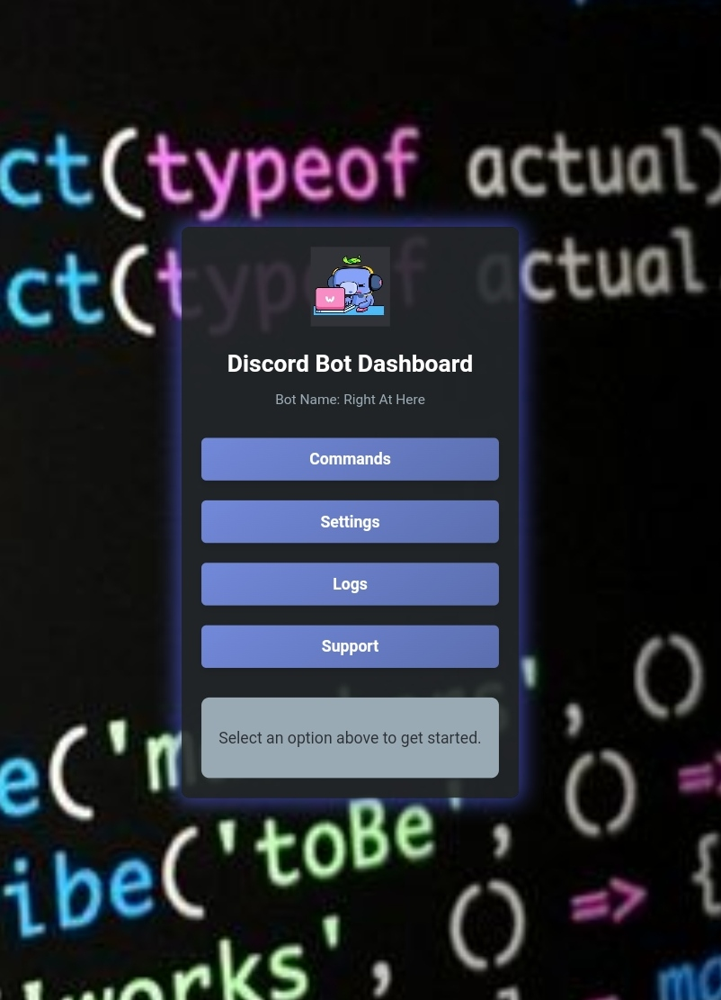

# Discord Bot Dashboard
This is a web-based dashboard for managing and monitoring your Discord bot, providing an easy-to-use interface to configure commands, settings, logs, and support options. This project is designed to simplify bot management, making it accessible for users without needing direct access to the bot’s codebase.

---

## Table of Contents

- [Features](#features)
- [Screenshots](#screenshots)
- [Getting Started](#getting-started)
  - [Prerequisites](#prerequisites)
  - [Installation](#installation)
  - [Configuration](#configuration)
  - [Running the Dashboard](#running-the-dashboard)
- [Usage](#usage)
- [Project Structure](#project-structure)
- [Built With](#built-with)
- [Contributing](#contributing)
- [License](#license)
- [Contact](#contact)

---

## Features

- **Commands**: View and manage bot commands directly from the dashboard.
- **Settings**: Configure bot settings to customize its behavior.
- **Logs**: View logs for bot actions and events.
- **Support**: Access support options for troubleshooting and resources.

---

## Screenshots

*(If possible, include a GIF of the dashboard in action for a more dynamic preview)*

---

## Getting Started

### Prerequisites

- **Node.js** (version 16 or above)
- **npm** (Node Package Manager)